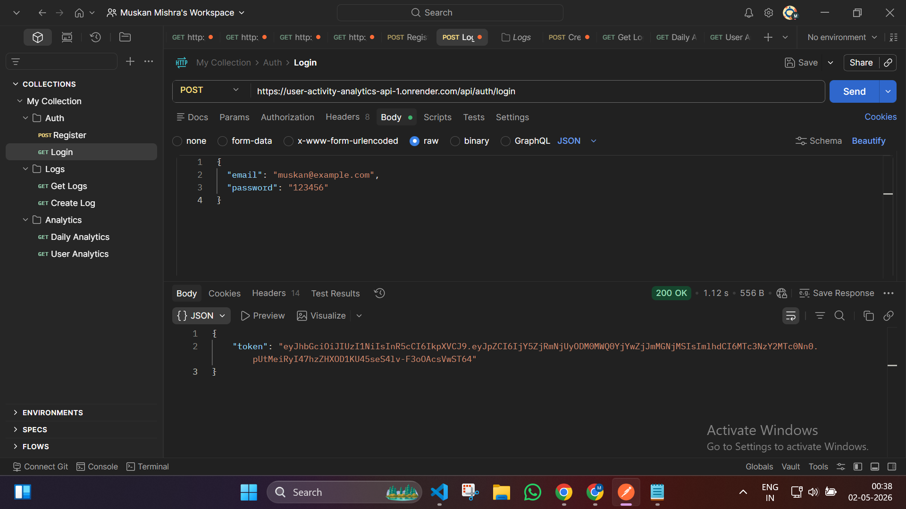
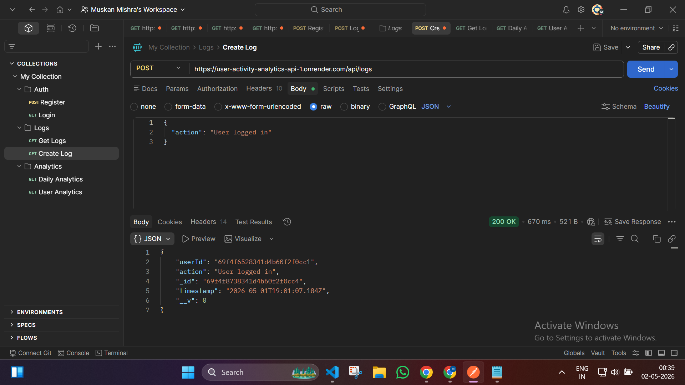
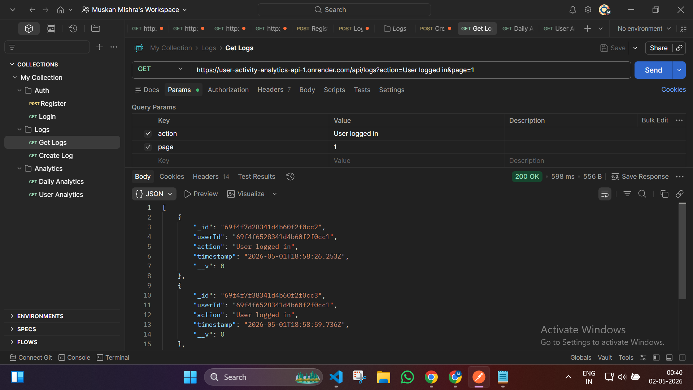
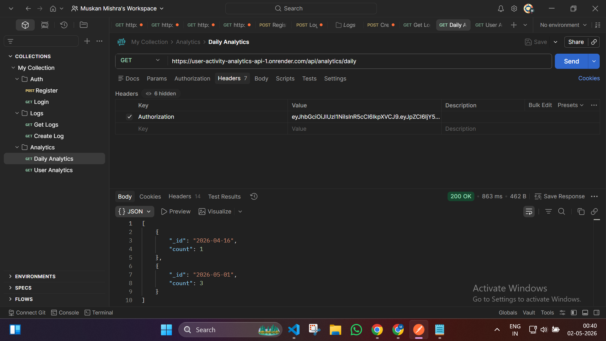
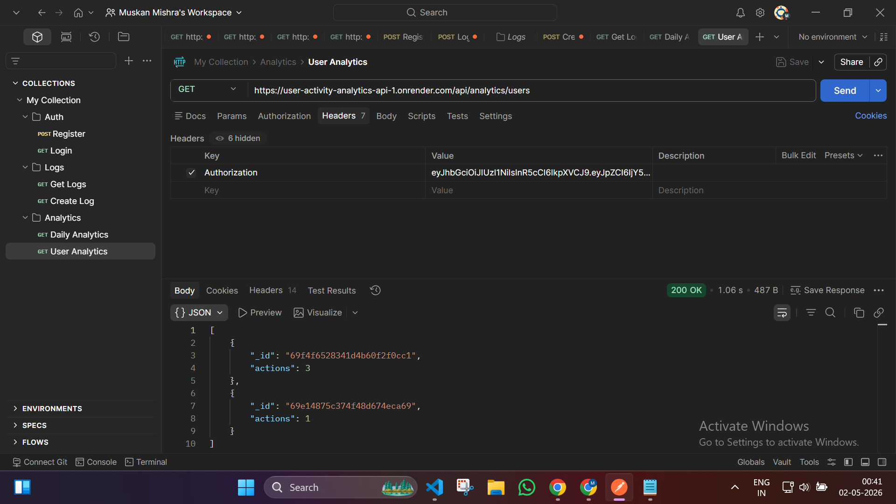

# 🚀 User Activity Logging & Analytics API

A scalable backend system designed to track, store, and analyze user activity in real-time. Built with a focus on clean architecture, secure authentication, and efficient data aggregation.

---

## 🌐 Live Demo

🔗**Frontend:** 
https://user-activity-analytics-fr-git-d13a00-muskan-mishra24s-projects.vercel.app/

 **API Base URL:**
https://user-activity-analytics-api-1.onrender.com

📌 You can test endpoints using Postman or any API client.

---

## 🧠 Problem It Solves

Modern applications need to understand user behavior. This API helps:

* Track user interactions
* Analyze activity trends
* Generate insights for decision-making

---

## 🛠 Tech Stack

* **Backend:** Node.js, Express.js
* **Database:** MongoDB
* **Authentication:** JWT (JSON Web Tokens)
* **Deployment:** Render

---

## ✨ Features

* 🔐 Secure JWT-based Authentication
* 📊 User Activity Logging
* 📈 Real-time Analytics using MongoDB Aggregation
* 🔎 Filtering & Pagination for logs
* 🧩 Modular & Scalable Architecture

---

## 📌 API Endpoints

### 🔑 Auth

* `POST /api/auth/register` – Register a new user
* `POST /api/auth/login` – Login and receive JWT

### 📝 Logs

* `POST /api/logs` – Create a new activity log
* `GET /api/logs` – Fetch logs (supports filters & pagination)

### 📊 Analytics

* `GET /api/analytics/daily` – Daily activity insights
* `GET /api/analytics/users` – User-wise analytics

---
## 📸 API Preview

### 🔐 Login (JWT Authentication)



---

### 📝 Create Log



---

### 🔍 Get Logs (Filtering + Pagination)



---

### 📊 Daily Analytics



---

### 👤 User Analytics



## 🧪 How to Test

1. Register a user
2. Login to get JWT token
3. Use token in headers:

   ```
   Authorization: Bearer <your_token>
   ```
4. Start logging activities and fetch analytics

---

## ⚙️ Setup Instructions (Local)

```bash
git clone https://github.com/muskan_mishra24/user-activity-analytics-api.git
cd user-activity-analytics-api
npm install
npm run dev
```

---

## 🔐 Environment Variables

Create a `.env` file and add:

```
PORT=5000
MONGO_URI=your_mongodb_connection
JWT_SECRET=your_secret_key
```

---

## 📷 Future Improvements

* Add frontend dashboard (React)
* Real-time analytics with WebSockets
* Role-based access control
* Export analytics reports

---

## 💼 Why This Project Matters

This project demonstrates:

* Backend system design
* REST API development
* Authentication & security
* Database aggregation & analytics

---

## 👩‍💻 Author

**Muskan Mishra**
🔗 https://github.com/muskan_mishra24
